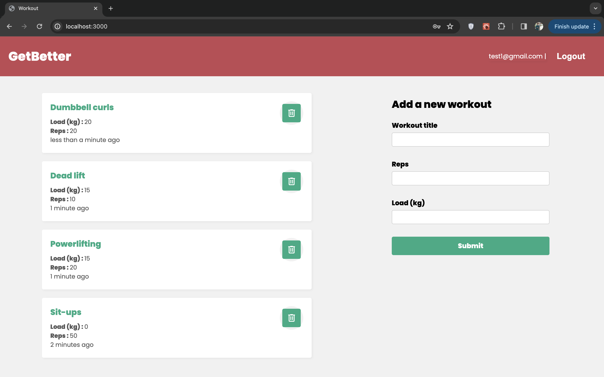

# GetBetter
A MERN stack web application to create your workout plan with a fully functional user authentication feature.
M - MongoDB
E - Express.js
R - React.js
N - Node.js  

## Screenshots
 

# Features  
- Create an account with a secure authentication system 
- View all your workout plans.
- Save or delete your workout plans    

## Dependencies
- State Management using Zustand: [zustand](https://github.com/pmndrs/zustand)
- Authentication system using JSON Web Token: [JWT](https://github.com/auth0/node-jsonwebtoken#readme)
- Encryption of password using [bcrypt](https://github.com/kelektiv/node.bcrypt.js#readme)
- Environment variables using [dotenv](https://github.com/motdotla/dotenv#readme)
- Mongoose for data schema and structure in MongoDB [Mongoose](https://mongoosejs.com/docs/)
- For validating email/password [Validator](https://github.com/validatorjs/validator.js) 